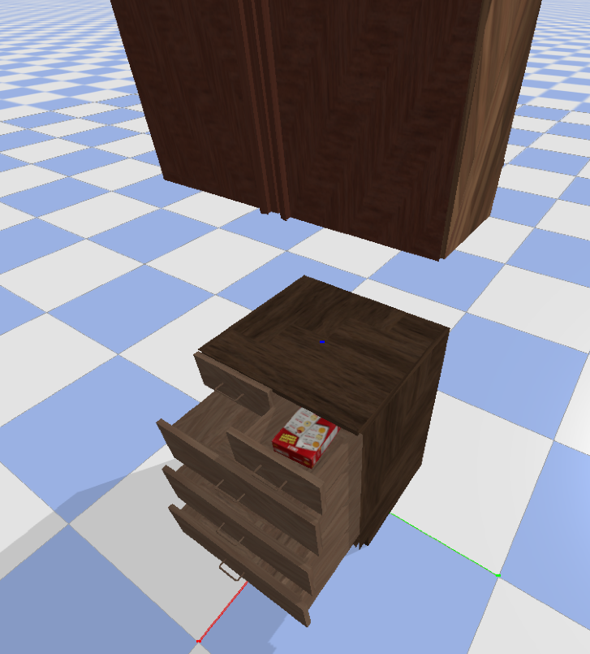

# Objects

### Overview
We provide a wide variety of **Objects** that can be imported into the **Simulator**.
- `YCBObject`
- `RBOObject`
- `ShapeNetObject`
- `Pedestrian`
- `ArticulatedObject`
- `URDFObject`
- `SoftObject`
- `Cube`
- `VisualMarker`
- `VisualShape`

Typically, they take in the name or the path of an object (in `gibson2.assets_path`) and provide a `load` function that be invoked externally (usually by `import_object` and `import_object` of `Simulator`). The `load` function imports the object into PyBullet. Some **Objects** (e.g. `ArticulatedObject`) also provide APIs to get and set the object pose.

Most of the code can be found here: [gibson2/objects](https://github.com/StanfordVL/iGibson/blob/master/gibson2/objects).

### Adding other objects to iGibson
We provide detailed instructions and scripts to import your own objects (non-articulated) into iGibson. 

Instruction can be found here: [External Objects](https://github.com/StanfordVL/iGibson/blob/master/gibson2/utils/data_utils/ext_object). 


### Examples
In this example, we import three objects into PyBullet, two of which are articulated objects. The code can be found here: [gibson2/examples/demo/object_example.py](https://github.com/StanfordVL/iGibson/blob/master/gibson2/examples/demo/object_example.py).

```python
from gibson2.objects.ycb_object import YCBObject
from gibson2.objects.articulated_object import ArticulatedObject
import gibson2
import os
import pybullet as p
import pybullet_data
import time


def main():
    p.connect(p.GUI)
    p.setGravity(0, 0, -9.8)
    p.setTimeStep(1./240.)

    floor = os.path.join(pybullet_data.getDataPath(), "mjcf/ground_plane.xml")
    p.loadMJCF(floor)

    cabinet_0007 = os.path.join(
        gibson2.assets_path, 'models/cabinet2/cabinet_0007.urdf')
    cabinet_0004 = os.path.join(
        gibson2.assets_path, 'models/cabinet/cabinet_0004.urdf')

    obj1 = ArticulatedObject(filename=cabinet_0007)
    obj1.load()
    obj1.set_position([0, 0, 0.5])

    obj2 = ArticulatedObject(filename=cabinet_0004)
    obj2.load()
    obj2.set_position([0, 0, 2])

    obj3 = YCBObject('003_cracker_box')
    obj3.load()
    obj3.set_position_orientation([0, 0, 1.2], [0, 0, 0, 1])

    for _ in range(24000):  # at least 100 seconds
        p.stepSimulation()
        time.sleep(1./240.)

    p.disconnect()


if __name__ == '__main__':
    main()

```

You can open the cabinet and the drawer by dragging your mouse over them. You can even put the cereal box into the drawer like this:


